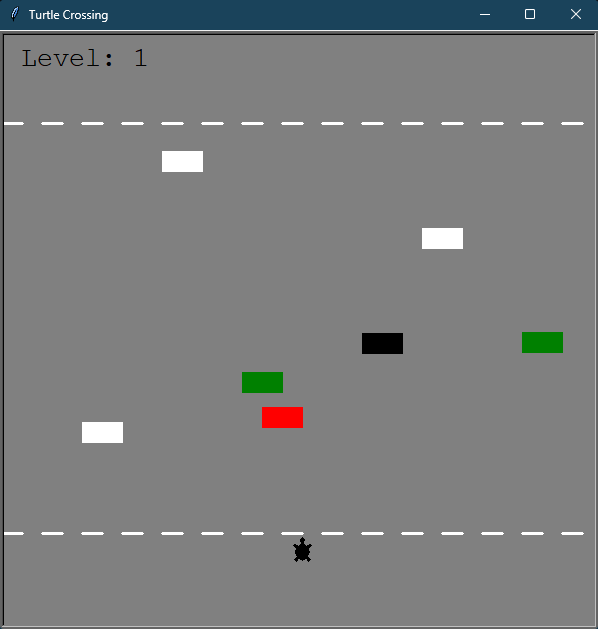

# Turtle Crossing
A recreation of the classic road crossing game (*Frogger*) in Python using the [Turtle package](https://docs.python.org/3/library/turtle.html).

Inspired by the project for day 23 of the course: [100 Days of Python](https://100daysofpython.dev/).

## Playing

Use `🠉` to move the turtle across the road without hitting any cars. Each crossing of the road is a level. The speed of the cars increases with each level. If the turtle hits a car, the game is over.

## Installing

1. Ensure [Python](https://www.python.org/) is installed on your computer.
2. Download the Python scripts from this repository (that is, the five `*.py` files) into the same folder.
3. Run `main.py`.

The game is based on the `turtle` package that is a pre-installed Python library. For possible issues with `turtle`, consult the [tutorial](https://docs.python.org/3/library/turtle.html).

## Modifying

Various parameters can be changed in the `parameters.py` script. Note however that some parameter values or combinations of values may make the game not function correctly or as intended. 

